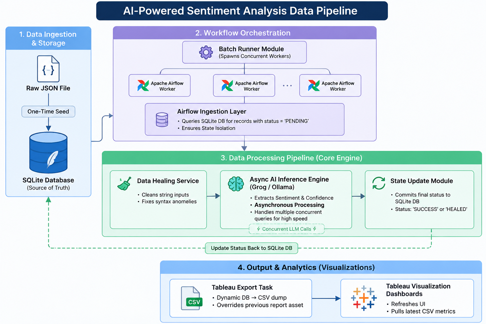

# Self-Correcting Data Pipeline

## Overview
The Self-Correcting Data Pipeline is an automated, scalable workflow designed to analyze the sentiment of customer reviews. It features robust self-healing mechanisms to handle dirty data and leverages **Apache Airflow 3**, **Groq (Llama 3.1)**, and **SQLite** for orchestration, LLM inference, and data storage respectively.



## Features
* **Airflow 3 Orchestration**: Uses the new Airflow 3 SDK (TaskFlow API) to define clean, declarative data pipelines.
* **Self-Healing Data Processing**: Automatically detects and rectifies common data quality issues (e.g., missing text, wrong data types, empty strings, overly long texts) before downstream processing.
* **LLM-Powered Sentiment Analysis**: Utilizes the Groq API (specifically `llama-3.1-8b-instant`) to accurately classify sentiments into POSITIVE, NEGATIVE, or NEUTRAL.
* **Concurrent Batch Processing**: Includes a robust batch runner (`batch_runner.py`) that parallelizes workload execution for high throughput.
* **Tableau Export**: Extracts processed data to a clean CSV format for visualization in Tableau or other BI tools.
* **Automated Health Reporting**: Generates comprehensive metrics and json health reports after every batch.

## Project Structure
* `dags/agentic_pipeline_dag.py`: The main Airflow DAG that handles ingestion, self-healing, LLM sentiment inference, database updates, and health reporting.
* `scripts/batch_runner.py`: A utility script to trigger Airflow DAG runs in parallel for concurrent batch processing.
* `scripts/export_tableau.py`: A script to export processed records from SQLite to a CSV file.
* `input/reviews.db`: The SQLite database containing customer reviews.
* `output/`: Directory where the pipeline writes run summaries and Tableau CSV exports.

## Prerequisites
* Python 3.12+ (tested with 3.12.3)
* Apache Airflow 3.0.0+
* Groq API Key

## Setup & Installation

1. **Set up a virtual environment:**
```bash
python -m venv venv
source venv/bin/activate
```

2. **Install dependencies:**
```bash
pip install -r requirements.txt
```

3. **Set your Groq API Key:**
Export your API key to your environment variables:
```bash
export GROQ_API_KEY='your-groq-api-key'
```

4. **Initialize Airflow:**
Set up the local Airflow environment:
```bash
export AIRFLOW_HOME=$(pwd)
airflow db migrate
```

## Usage

### 1. Run the Pipeline manually
To start the local Airflow server:
```bash
source venv/bin/activate
airflow standalone
```
You can then trigger the `self_healing_sentiment_pipeline` DAG manually via the Airflow Web UI.

### 2. Run Concurrent Batch Processing
Use the `batch_runner.py` script to process records in parallel:
```bash
# Process 10,000 records in batches of 1,000 with 4 concurrent workers
python scripts/batch_runner.py --total 10000 --batch-size 1000 --parallel 4
```

### 3. Export to Tableau
Once processing is complete, export your cleaned and classified data for visualization:
```bash
python scripts/export_tableau.py
```
The output will be saved in `output/tableau_export.csv`.

## Pipeline Stages
1. **Ingest Data**: Loads PENDING records from SQLite.
2. **Heal Reviews**: Validates and cleans raw text data.
3. **Analyze Sentiment**: Prompts the Llama 3.1 model via Groq API.
4. **Update Database**: Saves predictions, confidence scores, and statuses back to SQLite.
5. **Aggregate**: Generates a statistical summary of the batch.
6. **Health Report**: Evaluates the health tier (CRITICAL, DEGRADED, WARNING, HEALTHY) of the run.
